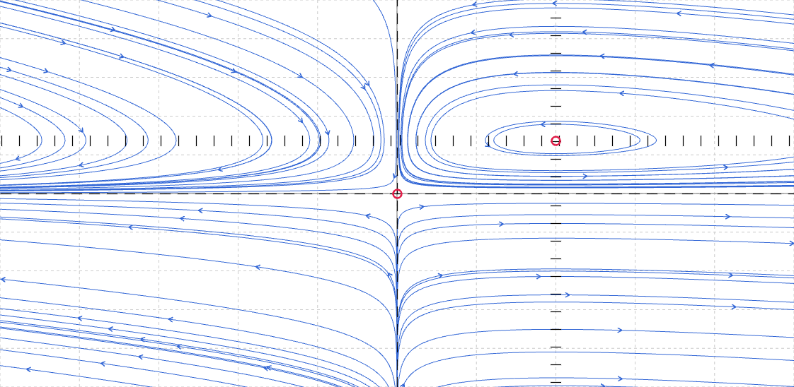
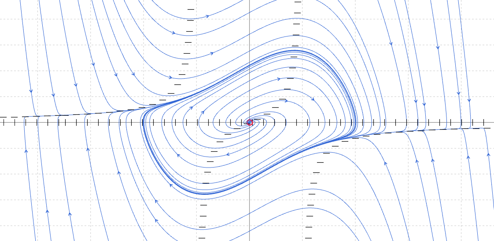

# Phase Plane Plotter

Interactive web application for visualizing phase plane diagrams of differential equations.

## Demo

[Live Demo](https://mechanical-turk.github.io/phase-plane/)

## Features

- **Real-time Phase Plane Plotting**: Visualize 2D autonomous differential equation systems
- **Interactive Trajectories**: Click to add trajectories, drag to pan, scroll to zoom
- **Customizable Equations**: Input your own differential equations using variables x, y, t, a, b, c, d, e
- **Vector Field Visualization**: See the direction and magnitude of the system at each point
- **Nullclines**: Display curves where x' = 0 and y' = 0
- **Equilibrium Points**: Automatically detect and mark stable/unstable equilibria

## Usage

1. Enter differential equations for x' and y' in the input fields
2. Adjust parameters a, b, c, d, e as needed
3. Click on the phase plane to add trajectories
4. Use checkboxes to toggle vector field, grid, nullclines, and equilibria
5. Pan by dragging, zoom with mouse wheel

## Example Equations

**Lotka-Volterra (Predator-Prey):**

- x' = a*x - b*x\*y
- y' = -c*y + d*x\*y

**Van der Pol Oscillator:**

- x' = y
- y' = -x + a*(1 - x^2)*y

